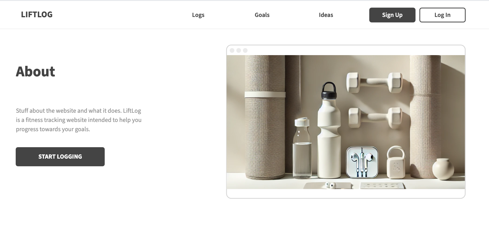
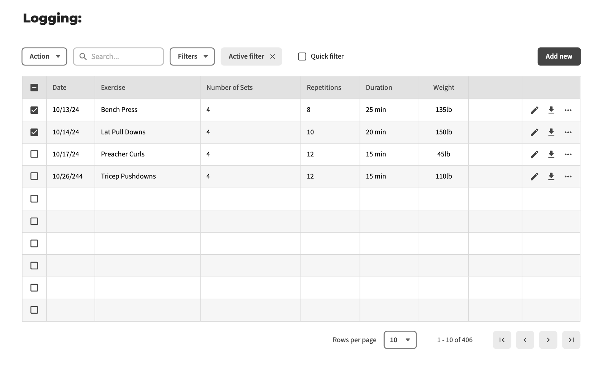

# Final Project

## Project Specifications

### Theme: Basic Fitness Tracking 
Fitness Pro is a full-stack web application for tracking personal fitness progress. The platform provides a way for users to log what they did while working out. In the gym community, some people carry around notebooks where they log what exercises they did, with what weight, and for how many sets/reps. People do this so they can "progressively overload" meaning gradually increasing weight or reps over time in order to get stronger. This web app would be a digital alternative for that. 

### Key Features and Functionality

Workout Logging: Users can log basic workout details like exercise type, duration, weight used, number of sets and reps, and any additional notes (e.g, “4 sets 10 reps of lat pull downs, weight 150lb”). This will be a straightforward form that updates the user’s activity log.

Basic Analytics: A simplified “My Progress” section that shows a summary of completed workouts and goal progress over time. This section will rely on basic AWS DynamoDB to render workout logs and goal status.

Goal setting: Users can set fitness goals for themselves and work towards it. For example, a user can input their goal of: train for and run a half marathon by January 1st. 

Progress Section: Users can also input data such as height, weight, body fat% etc. This can be a way for users to track their progress and see what has changed overtime. 

### Target Audience

The primary audience will be general fitness enthusiasts who seek a simple way to log their workouts and track progress. It can also cater towards beginners who are looking to start their fitness journey. Overall, this platform is meant to be user friendly and intuitive so anyone can use it!

### Data Management

The main data that will be managed is workout logs. This will be exercise details such as duration, weight, type, number of sets/reps etc. This information will be manged in AWS with the DynamoDB tables. 

### Stretch Goals 

Some goals for the future would include a way for the app to calculate the user input and turn it into a graph or progression bar. This would serve as a nice visual and way for users to see their progress overtime in a more graphical way. 
Also, another nice touch would be to add a nutrition tracker as well. This way the app can track your physical progress and nutrition progress. The users could add their protein, carb, and lipid intake. 

## Project Wireframe

